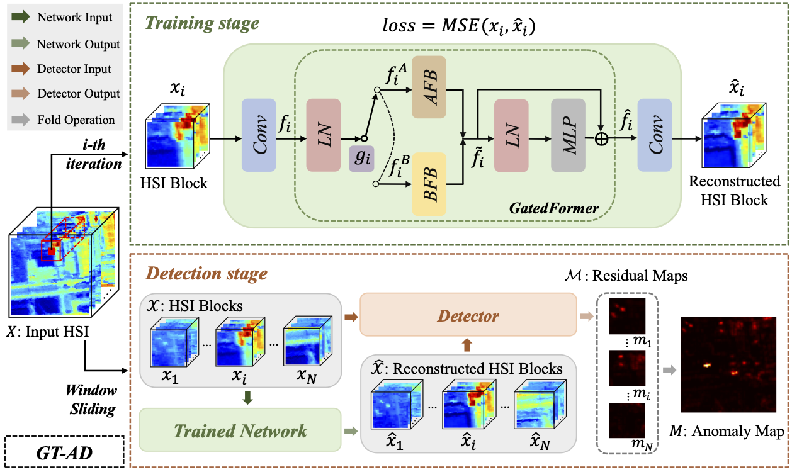

# GT-HAD

This is an official implementation of GT-HAD: Gated Transformer for Hyperspectral Anomaly Detection.

Framework of GT-HAD:



## 1. Comparison Methods:

In addition to GT-HAD, this repo includes the implementation of the following anomaly detection methods. DNN-based methods (Auto-AD, LREN) are available in `GT-HAD/dnnmethods`, and non-DNN methods (RX, KIFD, 2S-GLRT, MsRFQFT, CRD, GTVLRR, PTA, PCA-TLRSR) are available in `GT-HAD/non-dnnmethods`.

<details open>
<summary><b>Supported Algorithms:</b></summary>

* [x] [RX](https://ieeexplore.ieee.org/stamp/stamp.jsp?tp=&arnumber=60107)
* [x] [KIFD](https://ieeexplore.ieee.org/stamp/stamp.jsp?tp=&arnumber=8833502)
* [x] [2S-GLRT](https://ieeexplore.ieee.org/stamp/stamp.jsp?tp=&arnumber=9404853)
* [x] [MsRFQFT](https://ieeexplore.ieee.org/stamp/stamp.jsp?tp=&arnumber=10034420)
* [x] [CRD](https://ieeexplore.ieee.org/stamp/stamp.jsp?tp=&arnumber=6876207)
* [x] [GTVLRR](https://ieeexplore.ieee.org/stamp/stamp.jsp?tp=&arnumber=8833518)
* [x] [PTA](https://ieeexplore.ieee.org/stamp/stamp.jsp?tp=&arnumber=9288702) 
* [x] [PCA-TLRSR](https://ieeexplore.ieee.org/stamp/stamp.jsp?tp=&arnumber=9781337)  [](https://github.com/MinghuaWang123/PCA-TLRSR)
* [x] [Auto-AD](https://ieeexplore.ieee.org/stamp/stamp.jsp?tp=&arnumber=9382262) [](https://github.com/RSIDEA-WHU2020/Auto-AD)
* [x] [LREN](https://ojs.aaai.org/index.php/AAAI/article/view/16536)  [](https://github.com/xdjiangkai/LREN)

</details>
  
Besides, we also provide their original codes in `GT-HAD/original-codes`.
- RX, CRD, and 2S-GLRT are available in `GT-HAD/original-codes/2S-GLRT.zip`. 
- KIFD is available in `GT-HAD/original-codes/KIFD.zip`.
- MsRFQFT is available in `GT-HAD/original-codes/MsRFQFT.zip`.
- GTVLRR, PTA are available in `GT-HAD/original-codes/PTA.zip`.
- PCA-TLRSR is available in `GT-HAD/original-codes/PCA-TLRSRT.zip`.
- Auto-AD is available in `GT-HAD/original-codes/Auto-AD.zip`.
- LREN is available in `GT-HAD/original-codes/LREN.zip`.

## 2. Create Environment:
### 2.1 DNN-based Methods:

- Python 3 (Recommend to use [Anaconda](https://www.anaconda.com/download/#linux))
- NVIDIA GPU + [CUDA](https://developer.nvidia.com/cuda-downloads)
- Tensorflow for LREN
- Pytorch for Auto-AD and GT-HAD
- Numpy
- Sklearn
- Scipy
- Progressbar

### 2.2 Non-DNN Methods:

- MATLAB

### 2.3 Other Requirements:

- Matplotlib
- Seaborn

## 3. Prepare Dataset:

Datasets are available in `GT-HAD/data`.
```shell
-- los-angeles-1.mat
-- los-angeles-2.mat
-- gulfport.mat
-- texas-goast.mat
-- cat-island.mat
-- pavia.mat

```


## 4. Experiments:
### 4.1 Running: 

- DNN-based Methods:

```shell
# Auto-AD
cd GT-HAD/dnnmethods/Auto-AD/
python main.py 

# LREN
cd GT-HAD/dnnmethods/LREN/
python main.py 

# GT-HAD
cd GT-HAD/dnnmethods/GT-HAD/
python main.py 
```

- non-DNN Methods:

```shell
# RX
locate GT-HAD/non-dnnmethods/RX/
run run.m 

# KIFD
locate GT-HAD/non-dnnmethods/KIFD/
run run.m 

# 2S-GLRT
locate GT-HAD/non-dnnmethods/2S-GLRT/
run run.m 

# MsRFQFT
locate GT-HAD/non-dnnmethods/MsRFQFT/
run run.m

# CRD
locate GT-HAD/non-dnnmethods/CRD/
run run.m

# GTVLRR
locate GT-HAD/non-dnnmethods/GTVLRR/
run run.m

# PTA
locate GT-HAD/non-dnnmethods/PTA/
run run.m

# PCA-TLRSR
locate GT-HAD/non-dnnmethods/PCA-TLRSR/
run run.m
```

The detection results will be output into `GT-HAD/results/`. Taking RX as an example, **RX_map.mat** is used to draw color anomaly map and box-whisker plot, and **RX_roc.mat** is used to draw ROC curve and calculate AUC.

### 4.2 Testing:

- Generate color anomaly map:

```shell

cd GT-HAD/scripts/
python heatmap.py

```

- Generate box-whisker plot:

```shell

cd GT-HAD/scripts/
python boxplot.py

```

- Generate ROC curve and calculate AUC:

```shell

cd GT-HAD/scripts/
python roc.py

```

## 5. Citation:

If this repo helps you, please consider citing our work:

```shell
@article{gt-had,
  title={GT-HAD: Gated Transformer "for" Hyperspectral Anomaly Detection},
  author={Jie Lian and Lizhi Wang and He Sun and Hua Huang},
  journal={IEEE Transactions on Neural Networks and Learning Systems},
  year={2024}
}
```

## 6. Contact:

For any question, please contact:

```shell

lianjie@bit.edu.cn

```
